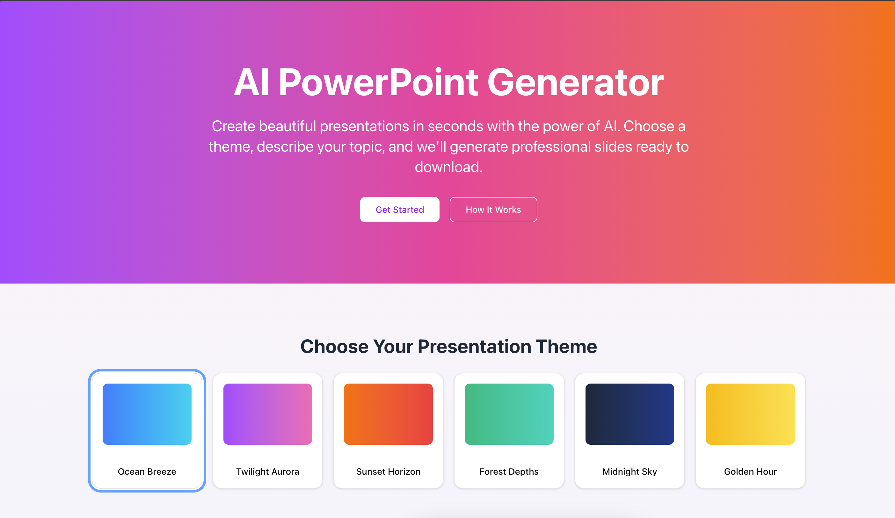

# PPT CraftAI - AI PowerPoint Generator



PPT CraftAI is a web application that leverages AI to automatically generate professional PowerPoint presentations. Simply describe your topic, specify your audience, and let the AI create beautiful, well-structured slides ready for download.

## Features

- **AI-Powered Content Generation**: Create comprehensive presentations with well-structured content based on your description
- **Customizable Themes**: Choose from multiple beautiful themes for your presentation
- **Live Preview**: See your presentation slides before downloading
- **Direct PPTX Download**: Download presentations in PPTX format ready for use in Microsoft PowerPoint
- **Responsive Design**: Works on desktop and mobile devices
- **Automatic Image Generation**: Relevant images are added to slides where appropriate

## Tech Stack

- **Frontend**: Next.js 15, React 19, TailwindCSS 4
- **Backend**: FastAPI (Python)
- **AI**: Gemini 2.0 (Google AI)
- **Libraries**:
  - pptxgenjs (PowerPoint generation)
  - React Hook Form (Form handling)
  - Framer Motion (Animations)
  - Zod (Validation)
  - Sonner (Toast notifications)

## Getting Started

### Prerequisites

- Node.js (v18 or higher)
- Python (v3.10 or higher)
- API keys for:
  - Google AI (Gemini)
  - Unsplash

### Installation

1. Clone the repository:
   ```bash
   git clone [your-repository-url]
   cd aipptgenerator
   ```

2. Install dependencies:
   ```bash
   npm install
   python -m venv .venv
   source .venv/bin/activate
   pip install -r requirements.txt
   ```

3. Create a `.env.local` file in the root directory with your API keys:
   ```
   GOOGLE_API_KEY=your_google_api_key
   UNSPLASH_API_KEY=your_unsplash_api_key
   NEXT_PUBLIC_BASE_URL=http://localhost:3000
   ```

### Running the Development Server

```bash
npm run dev
```

This will start both the Next.js frontend and FastAPI backend concurrently. Open [http://localhost:3000](http://localhost:3000) to view the application.

## Usage

1. Select a theme for your presentation from the theme selector
2. Fill in the presentation form:
   - Specify your target audience
   - Provide a detailed description of what you want in your presentation
   - Choose the number of slides (3-10 recommended)
   - Set the number of bullet points per slide (1-5)
3. Click "Generate Presentation"
4. Preview your generated slides in the preview area
5. Download the presentation as a PPTX file

## Project Structure

```
aipptgenerator/
├── public/                # Static assets
├── src/
│   ├── api/               # FastAPI backend
│   ├── app/               # Next.js app directory
│   ├── components/        # React components
│   │   ├── page/          # Page-specific components
│   │   └── ui/            # Reusable UI components
│   ├── context/           # React context providers
│   └── lib/               # Utility functions
└── ...                    # Configuration files
```

## Key Features Explained

### AI-Powered Content Generation
The application uses Google's Gemini 2.0 AI to analyze your topic description and audience specifications to generate appropriate slide content. The AI understands context and creates well-structured, coherent presentations.

### Theme System
Choose from a variety of visually appealing themes for your presentation, including:
- Ocean Breeze
- Twilight Aurora
- Sunset Horizon
- Forest Depths
- Midnight Sky
- Golden Hour

### Live Preview
Instantly see how your slides will look with the selected theme before downloading. Navigate through slides with intuitive controls.

### Native PPTX Export
Download your presentation directly as a .pptx file compatible with Microsoft PowerPoint, Google Slides, and other presentation software.

## License

This project is licensed under a **Custom License**.

**Restrictions**: Copying, redistribution, or commercial use of this project, in whole or in part, is strictly prohibited without prior written permission from the author.

For licensing inquiries, contact: [avikm744@gmail.com]

## Contribution Guidelines

Contributions are welcome! Here's how you can contribute:

1. Fork the repository
2. Create a new branch for your feature (`git checkout -b feature/amazing-feature`)
3. Commit your changes (`git commit -m 'Add some amazing feature'`)
4. Push to the branch (`git push origin feature/amazing-feature`)
5. Open a Pull Request

Please submit a pull request or open an issue to discuss potential changes before making major modifications.

## Acknowledgements

- [Next.js](https://nextjs.org/) - React framework
- [FastAPI](https://fastapi.tiangolo.com/) - Python API framework
- [Google Gemini](https://ai.google.dev/) - AI model provider
- [Unsplash](https://unsplash.com/) - Image provider
- [pptxgenjs](https://gitbrent.github.io/PptxGenJS/) - PowerPoint generation library

## Contact

Avik Mukherjee - [avikm744@gmail.com]

Project Link: [https://github.com/Avik-creator/aipptgenerator](https://github.com/Avik-creator/aipptgenerator)

